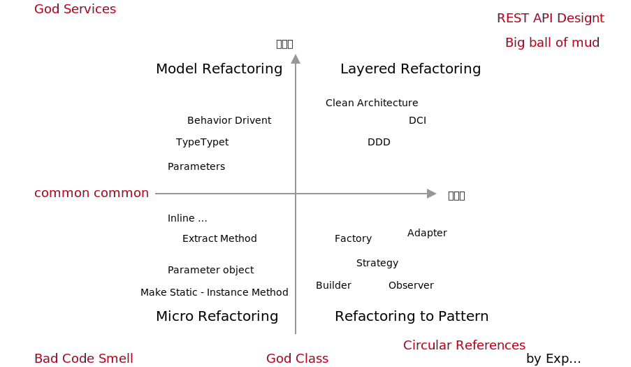
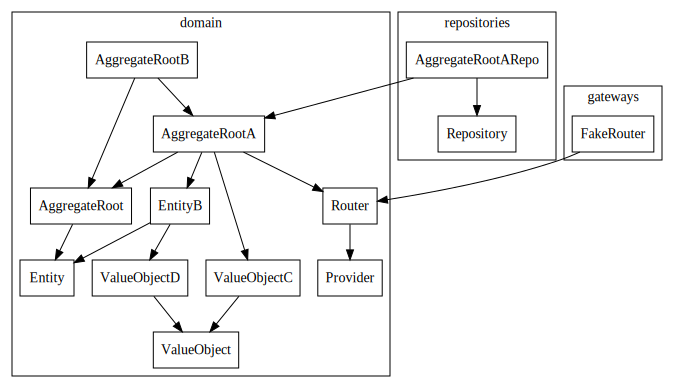
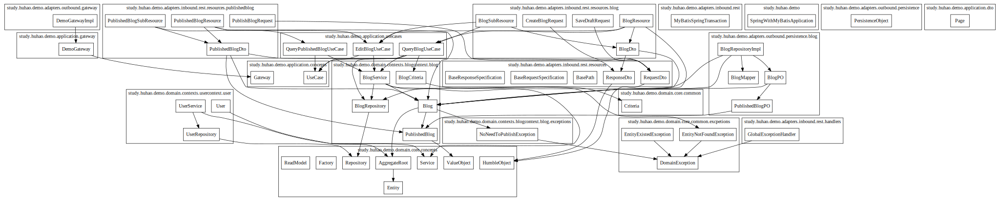
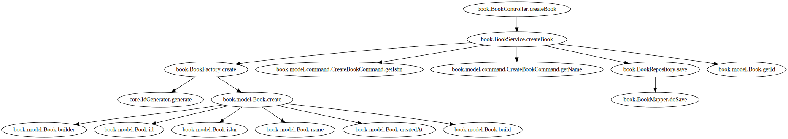
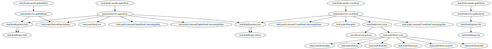

# Coca - toolbox for system refactoring and analysis


[](https://travis-ci.org/phodal/coca)
[](https://codeclimate.com/github/phodal/coca/maintainability)
[](https://codecov.io/gh/phodal/coca)


> [Coca](https://coca.migration.ink/) is a toolbox which is design for legacy system refactoring and analysis, includes call graph, concept analysis, api tree, design patterns suggest.
[Coca](https://coca.migration.ink/) 是一个用于系统重构、系统迁移和系统分析的瑞士军刀。它可以分析代码中的 badsmell，行数统计，分析调用与依赖，进行 Git 分析，以及自动化重构等。

Migration Guide (Chinese Version): 《[系统重构与迁移指南](https://github.com/phodal/migration)》

Inspired by: [newlee](https://github.com/newlee) & [Tequila](https://github.com/newlee/tequila)

Refactoring Modeling:



 - [ ] Languages Support
    - [x] Java (full features)
    - [x] Golang (support: analysis, todo, concept, git, suggest)
    - [x] TypeScript (antlr4 performance issue)
    - [x] Python (support: analysis, todo, concept, git, suggest)

Features List:

```
Available Commands:
  analysis    analysis code
  api         scan HTTP api from annotation
  arch        project package visualization
  bs          generate bad smell list and suggestions
  call        show call graph with specific method
  cloc        count lines of code with complexity estimation
  concept     build domain concept from source code
  count       count most refs function
  deps        evaluate dependencies
  evaluate    evaluate code situation and refactor effort
  git         analysis git commit history for revs count, summary and suggest
  help        Help about any command
  rcall       reverse call graph visualization
  refactor    auto refactor code
  suggest     find usable Design Patterns from code
  tbs         generate tests bad smell
  todo        scan all todo, and list with time
  version     version
```

Requirements:

1. [graphviz](https://www.graphviz.org/) for dot file to images (such as svg, png)

## Usage

install

```bash
go get -u github.com/phodal/coca
```

1. Run `coca analysis`
2. Run Command

### Analysis

```
coca analysis
```

### Arch

```
coca arch
```

Examples Results 1:



from: [https://github.com/newlee/tequila](https://github.com/newlee/tequila/tree/master/examples/step2-Java)

Examples Results 2:



from: [https://github.com/howiehu/ddd-architecture-samples](https://github.com/howiehu/ddd-architecture-samples)

### Find Bad Smells

```bash
coca bs -s type
```

Examples Result:

```json
{
   "dataClass": [
      {
         "File": "examples/api/BookController.java",
         "BS": "dataClass"
      }
   ],
   "lazyElement": [
      {
         "File": "examples/api/model/BookRepresentaion.java",
         "BS": "lazyElement"
      }
   ]
}
```

### Code Line Count

```
coca cloc
```

Results:

```
───────────────────────────────────────────────────────────────────────────────
Language                 Files     Lines   Blanks  Comments     Code Complexity
───────────────────────────────────────────────────────────────────────────────
Go                          58     31763     7132       890    23741       2847
Java                        44       971      208        21      742         62
Markdown                     8       238       75         0      163          0
Gherkin Specificati…         2        32        2        16       14          0
Document Type Defin…         1       293       36         0      257          0
License                      1       201       32         0      169          0
SQL                          1         2        0         0        2          0
SVG                          1       199        0        34      165          0
Shell                        1         3        1         1        1          0
XML                          1        13        0         0       13          0
gitignore                    1        61        8         4       49          0
───────────────────────────────────────────────────────────────────────────────
Total                      119     33776     7494       966    25316       2909
───────────────────────────────────────────────────────────────────────────────
Estimated Cost to Develop $803,822
Estimated Schedule Effort 14.120551 months
Estimated People Required 6.743156
───────────────────────────────────────────────────────────────────────────────
```

Results to json

```
coca cloc --by-file --format json
```

### Build Deps Tree

```
coca call -c com.phodal.pholedge.book.BookController.createBook -r com.phodal.pholedge.
```

Examples Results:



### Identify Spring API

```
coca api -f
```



With Count

```
coca api -r com.phodal.pholedge. -c 
``` 

or multi package:

`coca api  -r com.macro.mall.demo.controller.,com.zheng.cms.admin.,com.phodal.pholedge -c` 

```bash
+------+--------+------------------------------------------------+------------------------------------------------------------------------+
| SIZE | METHOD |                      URI                       |                                 CALLER                                 |
+------+--------+------------------------------------------------+------------------------------------------------------------------------+
|   36 | GET    | /aliyun/oss/policy                             | controller.OssController.policy                                        |
|   21 | POST   | /aliyun/osscallback                            | controller.OssController.callback                                      |
|   17 | GET    | /subject/list                                  | controller.CmsSubjectController.getList                                |
|   17 | GET    | /esProduct/search                              | search.controller.EsProductController.search                           |
|   17 | GET    | /order/list                                    | controller.OmsOrderController.list                                     |
|   17 | GET    | /productAttribute/list/{cid}                   | controller.PmsProductAttributeController.getList                       |
|   17 | GET    | /productCategory/list/{parentId}               | controller.PmsProductCategoryController.getList                        |
|   17 | GET    | /brand/list                                    | controller.PmsBrandController.getList                                  |
|   17 | GET    | /esProduct/search/simple                       | search.controller.EsProductController.search                           |
+------+--------+------------------------------------------------+------------------------------------------------------------------------+
```

### Git Analysis

```
coca git -t
```

Results: 

```bash
+---------------------------------------------------------------------------------------------------------------------+-----------+-------------+
|                                                     ENTITYNAME                                                      | REVSCOUNT | AUTHORCOUNT |
+---------------------------------------------------------------------------------------------------------------------+-----------+-------------+
| build.gradle                                                                                                        |      1326 |          36 |
| src/asciidoc/index.adoc                                                                                             |       239 |          20 |
| build-spring-framework/resources/changelog.txt                                                                      |       187 |          10 |
| spring-core/src/main/java/org/springframework/core/annotation/AnnotationUtils.java                                  |       170 |          10 |
| spring-beans/src/main/java/org/springframework/beans/factory/support/DefaultListableBeanFactory.java                |       159 |          15 |
| src/docs/asciidoc/web/webmvc.adoc                                                                                   |       121 |          24 |
| spring-context/src/main/java/org/springframework/context/annotation/ConfigurationClassParser.java                   |       118 |           9 |
| src/dist/changelog.txt                                                                                              |       118 |           9 |
| spring-webmvc/src/main/java/org/springframework/web/servlet/config/annotation/WebMvcConfigurationSupport.java       |       116 |          15 |
| spring-beans/src/main/java/org/springframework/beans/factory/support/AbstractAutowireCapableBeanFactory.java        |       113 |          15 |
| spring-web/src/main/java/org/springframework/http/HttpHeaders.java                                                  |       111 |          18 |
| src/docs/asciidoc/web/webflux.adoc                                                                                  |       108 |          21 |
| spring-core/src/main/java/org/springframework/core/annotation/AnnotatedElementUtils.java                            |       107 |           9 |
| spring-test/spring-test.gradle                                                                                      |       105 |           7 |
| spring-webmvc/src/main/java/org/springframework/web/servlet/mvc/method/annotation/RequestMappingHandlerAdapter.java |       105 |          13 |
| spring-messaging/src/main/java/org/springframework/messaging/simp/stomp/StompBrokerRelayMessageHandler.java         |       101 |          12 |
| spring-web/src/main/java/org/springframework/web/client/RestTemplate.java                                           |        98 |          17 |
| spring-webmvc/src/main/java/org/springframework/web/servlet/resource/ResourceHttpRequestHandler.java                |        96 |          14 |
| org.springframework.core/src/main/java/org/springframework/core/convert/TypeDescriptor.java                         |        93 |           4 |
| spring-core/src/main/java/org/springframework/core/ResolvableType.java                                              |        92 |          10 |
+---------------------------------------------------------------------------------------------------------------------+-----------+-------------+
```

### Concept Analyser

```
coca concept
```

Results Examples:

```
+------------------+--------+
|      WORDS       | COUNTS |
+------------------+--------+
| context          |    590 |
| resolve          |    531 |
| path             |    501 |
| content          |    423 |
| code             |    416 |
| resource         |    373 |
| property         |    372 |
| session          |    364 |
| attribute        |    349 |
| properties       |    343 |
| headers          |    330 |
+------------------+--------+
```

### Count Refs

```
coca count
```

Results:

```
+------------+--------------------------------------------------------------------------+
| REFS COUNT |                                  METHOD                                  |
+------------+--------------------------------------------------------------------------+
|          2 | com.phodal.pholedge.book.BookRepository.byId                             |
|          2 | com.phodal.pholedge.book.model.Book.toRepresentation                     |
|          2 | com.phodal.pholedge.book.BookRepository.save                             |
|          2 | com.phodal.coca.analysis.JavaCallApp.parse                               |
|          2 | com.phodal.pholedge.book.BookRepository.save                             |
|          2 | com.phodal.coca.analysis.JavaCallApp.parse                               |
|          1 | com.phodal.pholedge.book.model.Book.save                                 |
|          1 | evolution.analysis.jv.calls.JavaCallVisitor.parseNewType                 |
|          1 | evolution.analysis.jv.calls.JavaCallVisitor.isNotSpecialNewWord          |
|          1 | com.phodal.pholedge.book.BookMapper.byId                                 |
|          1 | com.phodal.pholedge.book.BookService.updateBook                          |
|          1 | com.phodal.pholedge.book.BookService.getBooksLists                       |
|          1 | com.phodal.pholedge.book.BookService.getBookById                         |
|          1 | com.phodal.pholedge.book.BookMapper.doSave                               |
|          1 | com.phodal.pholedge.book.BookMapper.list                                 |
|          1 | com.phodal.pholedge.book.BookService.createBook                          |
|          1 | com.phodal.pholedge.book.BookFactory.create                              |
|          1 | com.phodal.pholedge.book.BookRepository.list                             |
|          1 | com.phodal.pholedge.book.model.Book.create                               |
+------------+--------------------------------------------------------------------------+
```

### Reverse Call Graph

```
coca rcall -c org.bytedeco.javacpp.tools.TokenIndexer.get
```

Results:

```
digraph G { 
edge [dir="back"];

"org.bytedeco.javacpp.tools.Parser.extern" -> "org.bytedeco.javacpp.tools.Parser.declarations";
"org.bytedeco.javacpp.tools.Parser.declarations" -> "org.bytedeco.javacpp.tools.Parser.extern";
...
}
```


### Auto Refactor

support: 

 - rename
 - move
 - remove unused import
 - remove unused class

```
coca refactor -R rename.coca -p src/main
coca refactor -m move.config -p .
```

### Evaluate

```
coca evaluate
```

Arduino Results:

```
+--------------------------------+-------+-----------------------+-------+-----------+
|              TYPE              | COUNT |         LEVEL         | TOTAL |   RATE    |
+--------------------------------+-------+-----------------------+-------+-----------+
| Nullable / Return Null         |     0 | Method                |  1615 | 0.00%     |
| Utils                          |     7 | Class                 |   252 | 2.78%     |
| Static Method                  |     0 | Method                |  1615 | 0.43%     |
| Average Method Num.            |  1615 | Method/Class          |   252 |  6.408730 |
| Method Num. Std Dev / 标准差   |  1615 | Class                 | -     |  7.344917 |
| Average Method Length          | 13654 | Without Getter/Setter |  1100 | 12.412727 |
| Method Length Std Dev / 标准差 |  1615 | Method                | -     | 20.047092 |
+--------------------------------+-------+-----------------------+-------+-----------+
```

Evaluate.json examples

```json
{
	"Nullable": {
		"Items": [
			"nonnull.Name.testNull",
			"nonnull.Name.orElseNull",
			"org.ofbiz.base.util.UtilURL.fromResource",
			"org.ofbiz.base.util.UtilURL.getOfbizHomeRelativeLocationFromFilePath",
			"study.huhao.demo.adapters.outbound.persistence.blog.BlogPO.toDomainModel",
			"study.huhao.demo.adapters.outbound.persistence.blog.BlogPO.toDomainModel",
			"study.huhao.demo.adapters.outbound.persistence.blog.BlogPO.of",
			"study.huhao.demo.infrastructure.persistence.blog.BlogPO.convertDomain"
		]
	},
	"ServiceSummary": {
		"LifecycleMap": null,
		"ReturnTypeMap": {
			"BookRepresentaion": [
				"com.phodal.pholedge.book.BookService.getBookById",
				"com.phodal.pholedge.book.BookService.updateBook"
			]
		},
		"RelatedMethod": null
	},
	"UtilsSummary": {},
	"Summary": {
		"UtilsCount": 1,
		"ClassCount": 64,
		"MethodCount": 161,
		"StaticMethodCount": 19
	}
}
```

### Todo

```
coca todo
```

results:

```
+------------+-----------------+--------------------------------+--------------------------------------------------------------------------------------+------+
|    DATE    |     AUTHOR      |            MESSAGES            |                                       FILENAME                                       | LINE |
+------------+-----------------+--------------------------------+--------------------------------------------------------------------------------------+------+
| 2019-12-09 | Cristian Maglie | happens on macosx, don't know  | app/src/cc/arduino/contributions/libraries/ui/ContributedLibraryTableCellJPanel.java |  118 |
|            |                 | why                            |                                                                                      |      |
| 2019-12-09 | Cristian Maglie | Make this a method of Theme    | app/src/cc/arduino/contributions/libraries/ui/ContributedLibraryTableCellJPanel.java |  233 |
| 2019-12-09 | Cristian Maglie | Do a better job in refreshing  | app/src/cc/arduino/contributions/libraries/ui/LibraryManagerUI.java                  |  241 |
|            |                 | only the needed element        |                                                                                      |      |
| 2019-12-09 | Cristian Maglie | Do a better job in refreshing  | app/src/cc/arduino/contributions/libraries/ui/LibraryManagerUI.java                  |  273 |
|            |                 | only the needed element        |                                                                                      |      |
| 2019-12-09 | Cristian Maglie | Make this a method of Theme    | app/src/cc/arduino/contributions/libraries/ui/MultiLibraryInstallDialog.java         |  149 |
| 2019-12-09 | Cristian Maglie | happens on macosx, don't know  | app/src/cc/arduino/contributions/packages/ui/ContributedPlatformTableCellJPanel.java |  183 |
|            |                 | why                            |                                                                                      |      |
| 2019-12-09 | Cristian Maglie | show error                     | app/src/processing/app/Base.java                                                     | 1440 |
| 2019-12-09 | Cristian Maglie | error when importing. ignoring | app/src/processing/app/Base.java                                                     | 2423 |
|            |                 | :(                             |                                                                                      |      |
| 2019-12-09 | Cristian Maglie | Improve / move error handling  | app/src/processing/app/Editor.java                                                   | 1541 |
| 2019-12-09 | Cristian Maglie | Should be a Theme value?       | app/src/processing/app/EditorHeader.java                                             |   78 |
| 2019-12-09 | Cristian Maglie | Should be a Theme value?       | app/src/processing/app/EditorStatus.java                                             |   73 |
| 2019-12-09 | Cristian Maglie | Improve decoupling             | app/src/processing/app/EditorTab.java                                                |  465 |
+------------+-----------------+--------------------------------+--------------------------------------------------------------------------------------+------+```
```

### Suggest

```
coca suggest
```

results:

```
+--------+------------------+--------------------------------+
| CLASS  |     PATTERN      |             REASON             |
+--------+------------------+--------------------------------+
| Insect | factory          | too many constructor           |
| Bee    | factory, builder | complex constructor, too       |
|        |                  | many constructor, too many     |
|        |                  | parameters                     |
+--------+------------------+--------------------------------+
```

### Test Bad Smells

```
coca tbs
``` 

results

```bash
+---------------------+---------------------------------------------------------------+------+
|        TYPE         |                           FILENAME                            | LINE |
+---------------------+---------------------------------------------------------------+------+
| DuplicateAssertTest | app/test/cc/arduino/i18n/ExternalProcessOutputParserTest.java |  107 |
| DuplicateAssertTest | app/test/cc/arduino/i18n/ExternalProcessOutputParserTest.java |   41 |
| DuplicateAssertTest | app/test/cc/arduino/i18n/ExternalProcessOutputParserTest.java |   63 |
| RedundantPrintTest  | app/test/cc/arduino/i18n/I18NTest.java                        |   71 |
| RedundantPrintTest  | app/test/cc/arduino/i18n/I18NTest.java                        |   72 |
| RedundantPrintTest  | app/test/cc/arduino/i18n/I18NTest.java                        |   77 |
| DuplicateAssertTest | app/test/cc/arduino/net/PACSupportMethodsTest.java            |   19 |
| DuplicateAssertTest | app/test/processing/app/macosx/SystemProfilerParserTest.java  |   51 |
| DuplicateAssertTest | app/test/processing/app/syntax/PdeKeywordsTest.java           |   41 |
| DuplicateAssertTest | app/test/processing/app/tools/ZipDeflaterTest.java            |   57 |
| DuplicateAssertTest | app/test/processing/app/tools/ZipDeflaterTest.java            |   83 |
| DuplicateAssertTest | app/test/processing/app/tools/ZipDeflaterTest.java            |  109 |
+---------------------+---------------------------------------------------------------+------+
```

### Find unused deps

```
coca  deps -p _fixtures/deps/maven_sample
```

results:

```
+---------------------------+----------------------------------------+---------+
|          GROUPID          |               ARTIFACTID               |  SCOPE  |
+---------------------------+----------------------------------------+---------+
| org.flywaydb              | flyway-core                            |         |
| mysql                     | mysql-connector-java                   | runtime |
| org.springframework.cloud | spring-cloud-starter-contract-verifier | test    |
+---------------------------+----------------------------------------+---------+
```

## Roadmap

 - bad smell support
   - [x] sort method size
   - type
     - [x] longParameterList
     - [x] longMethod
     - [x] repeatedSwitches
     - [x] complexIf
     - [x] largeClass
     - [x] refusedBequest
     - [x] dataClass
 - CLOC
 - HTTP API Visualization
    - [x] Spring Support
    - [x] @Service Support
    - [x] API Call Size
 - Git
    - [x] Revs Counts
    - [x] Summary
    - [ ] [git-quick-stats](https://github.com/arzzen/git-quick-stats)
 - Concept
    - [x] words NLP
    - [ ] to domain        
 - Call & rcall graph
    - [x] Count Refs
 - AutoRefactor
   - [x] remove unused
   - [x] move files
 - Evaluate
   - [x] nullable count
   - [x] static count
   - [x] method num /length count
 - Todo Summary
    - [x] Todo with History & Author   
 - Suggest API for Design Patterns
   - [x] factory pattern
   - [x] strategy 
   - [x] builder
   - [ ] cycle-deps -> adapter / agency
   - [ ] bad patterns
       - [ ] singleton
 -  Evaluate API
    - [x] Average Method Length
    - [x] Average Class Method Count
 - Tests
    - [ ] Testable?
    - [x] Test badsmell -> list [https://testsmells.github.io/pages/testsmells.html]
      - [x] IgnoreTest: @Ingore
      - [x] EmptyTest: not call in test
      - [x] RedundantPrintTest: system.out.println
      - [x] SleepyTest: Time.sleep
      - [x] RedundantAssertionTest: assertTrue(True) 
      - [x] UnknownTest: not assert
      - [x] DuplicateAssertTest: assert > 5
      - [ ] TestersOnly: method only call by test
      - [ ] CrossBorderTest: test method which not in system
      - [ ] General Fixture: JUnit classes having at least one method not using the entire test fixture defined in the setUp() method
 - Arch
    - [x] Architecture Visualization
    - [ ] Architecture Guard
      - [ ] DSL Design
 - Tech Debt from Source Code
    - [ ] auto create story
 - TBD
    - Comment Analysis
      - [ ] incorrect comment ? http://das.encs.concordia.ca/uploads/2018/02/Maldonado_thesis.pdf
 - Online Code Analysis
    - [x] WASM support
    - [ ] expose WASM API
    - [ ] GitHub search code
 - [ ] Pluggable
    - [ ] plugin support (Windows Issues)
 - [x] Dependence Analysis
    - [ ] Deps Related Counts
    - [x] 3rd-party analysis XML or Groovy Scripts
    - [x] Groovy Support
      - [x] migrate to Golang Styles
 - [ ] Story Cmd
 - [ ] Clean Code Suggest
    - [ ] JavaScript Version [clean-code-javascript](https://github.com/ryanmcdermott/clean-code-javascript)
 - [ ] More CodeSmells
    - [ ] Source [DesigniteJava](https://github.com/tushartushar/DesigniteJava)

Documents Todo:

 - [ ] Docs
    - [ ] Lifecycle for new projects: evaluate (cloc, bad smell, api, git, todo) -> design -> patterns (suggest) -> refactoring ()
 - Date Collections
    - [ ] monolithic
    - [ ] microservice 
    - [ ] big data

Tech Debt

 - Test for Windows
 - Duplicate Code
   - cmd/ -> user builder to refactoring

## Dev

Install Go

```bash
brew install go
```

Env

```bash
export GOROOT=/usr/local/opt/go/libexec
export GOPATH=$HOME/.go
export PATH=$PATH:$GOROOT/bin:$GOPATH/bin
```

clone

```
git clone https://github.com/phodal/coca
```

Test Frameworks

```
go get github.com/onsi/ginkgo
go get github.com/onsi/gomega
```

License
---

Arch based on [Tequila](https://github.com/newlee/tequila)

Git Analysis inspired by [Code Maat](https://github.com/adamtornhill/code-maat)

Test bad smells inspired by [Test Smell Examples](https://testsmells.github.io/pages/testsmellexamples.html)

[](http://ideas.phodal.com/)

@ 2019 A [Phodal Huang](https://www.phodal.com)'s [Idea](http://github.com/phodal/ideas).  This code is distributed under the MPL license. See `LICENSE` in this directory.
